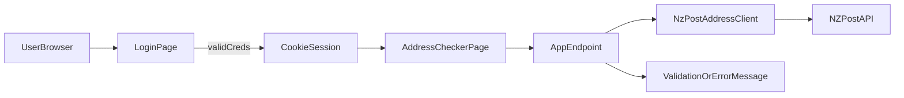

# .NET Azure Quality Assessment Plan

## Scope And Defaults

- Build a **small ASP.NET Core web app** with a login gate and a protected address-check page.
- Use **hard-coded test credentials** (allowed by brief) to keep authentication lightweight.
- Integrate NZ Post address checker via a server-side API client with resilient error handling.
- Host on **Azure App Service** (simple and fast for this timebox), with option to run locally first.
- Use GitHub for source control and GitHub Actions for CI quality checks.

## Proposed Architecture

- **Frontend/UI:** Razor Pages (or minimal MVC views) for low setup overhead.
- **Backend:** ASP.NET Core app handling login session + proxying address validation requests.
- **Auth model:** Cookie/session auth with fixed credentials from config.
- **External dependency:** `NzPostAddressClient` service wrapping HTTP calls + timeout/retry guard.
- **Testing layers (risk-based):**
  - Primary: NUnit integration/service tests for login rules + address validation behavior.
  - Supporting: Playwright smoke E2E for critical user journeys.

## Implementation Plan

1. **Bootstrap project**

- Create ASP.NET Core web app skeleton and basic pages.
- Add config structure for credentials, NZ Post API key, timeout settings.
- Define environment variable mapping for secrets.

1. **Implement login gate**

- Build login form and validation (empty fields, invalid credentials).
- Add protected route/page for address checker.
- Ensure unauthenticated access redirects to login.

1. **Implement address validation flow**

- Add input with near-real-time lookup trigger (debounced client request or explicit lookup button if faster).
- Build server endpoint/service calling NZ Post API.
- Handle valid/invalid/partial results and display clear messages.
- Add failure handling for upstream timeout/unavailable states.

1. **Automated test suite**

- NUnit tests:
  - Login: valid, invalid, empty, protected-page enforcement.
  - Address: empty input, valid/invalid/partial mapping logic, API failure fallback.
- Playwright tests:
  - Login success smoke.
  - Login failure message.
  - End-to-end address lookup happy path (with controlled test data).

1. **CI and repository readiness**

- Add GitHub Actions workflow to run build + NUnit + Playwright (headless).
- Add setup docs and `.env`/secret instructions.
- Keep pipeline small and deterministic.

1. **Assessment artifacts**

- Add short `TEST_STRATEGY.md`: tested vs not tested and why.
- Add `AI_USAGE.md`: where AI assisted and verification steps taken.
- Add concise `README.md`: run locally, test commands, CI overview, Azure deployment notes.

## File/Folder Blueprint

- [c:\Dev\Meena\AioiAssessment02\src\WebApp(c:\Dev\Meena\AioiAssessment02\src\WebApp
- [c:\Dev\Meena\AioiAssessment02\tests\WebApp.Tests(c:\Dev\Meena\AioiAssessment02\tests\WebApp.Tests
- [c:\Dev\Meena\AioiAssessment02\tests\WebApp.E2E(c:\Dev\Meena\AioiAssessment02\tests\WebApp.E2E
- [c:\Dev\Meena\AioiAssessment02github\workflows\ci.yml](c:\Dev\Meena\AioiAssessment02.github\workflows\ci.yml)
- [c:\Dev\Meena\AioiAssessment02\README.md](c:\Dev\Meena\AioiAssessment02\README.md)
- [c:\Dev\Meena\AioiAssessment02\TEST_STRATEGY.md](c:\Dev\Meena\AioiAssessment02\TEST_STRATEGY.md)
- [c:\Dev\Meena\AioiAssessment02\AI_USAGE.md](c:\Dev\Meena\AioiAssessment02\AI_USAGE.md)

## Timebox Guidance (4–5 Hours)

- 60–90m: app skeleton + login.
- 60–90m: address checker integration + unhappy paths.
- 60–90m: NUnit + Playwright critical tests.
- 30–45m: CI workflow + docs + submission cleanup.

## Azure + GitHub Delivery Path

- Develop and verify locally first.
- Push to GitHub repository with CI workflow enabled.
- Deploy web app to Azure App Service using publish profile or OIDC-based GitHub Action.
- Store secrets (API key, credentials) in GitHub Secrets and Azure App Settings.
- Share deployed URL + repo + quality notes as final submission package.

